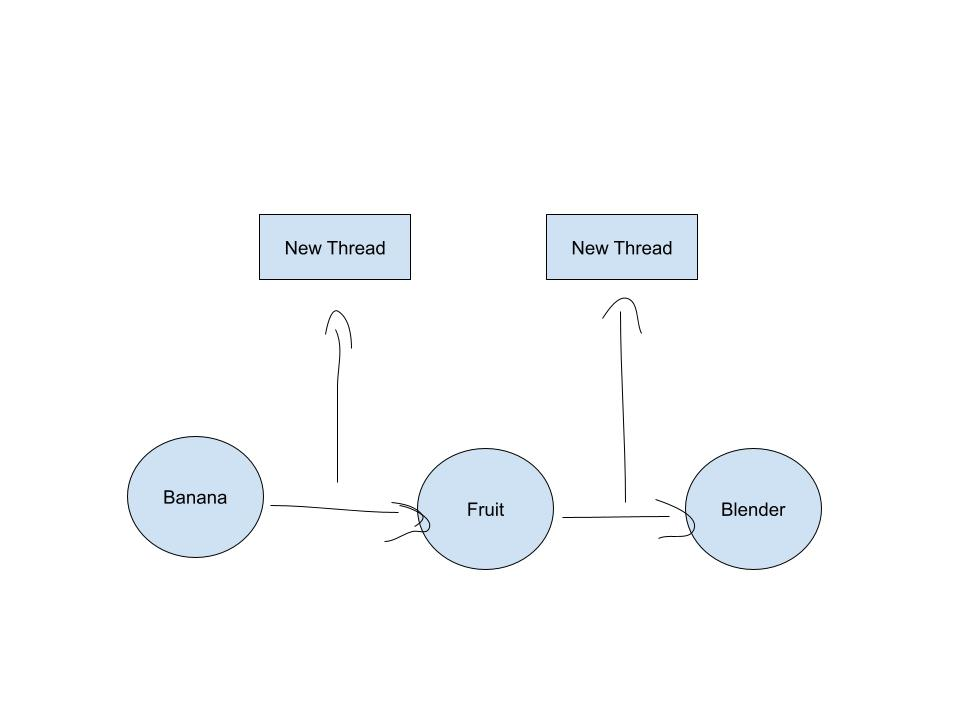
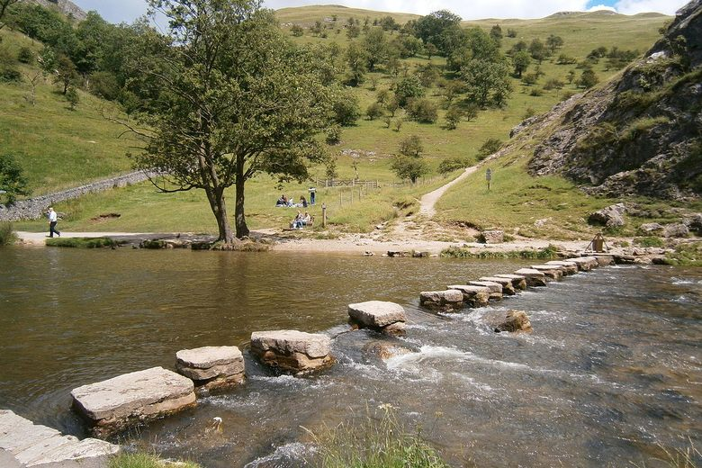

# Wikipedia Game Improvement Proposal (WGIP)

## Authors
- Author: Luke Morissette and Kevan Parang

# Milestones
## Milestone 1: Data Preparation and Preprocessing
Obtain a dump of Wikipedia articles or use an existing dataset
Preprocess the text data (tokenization, stopword removal, stemming/lemmatization)
Train a Word2Vec model on the preprocessed Wikipedia data using the gensim library
Calculate and store the cosine similarity between each pair of Wikipedia articles

## Milestone 2: Parallel Path Finding Implementation 
Implement the find_path function to perform a breadth-first search between two Wikipedia articles
Develop the full_path function to calculate the cosine similarity between the start and end articles
Determine the number of midpoints based on the cosine similarity difference
Create and manage threads for parallel path finding between the midpoints
Collect and order the paths from the threads

## Milestone 3: User Interface and Integration 
Create a user interface (e.g., command-line or web-based) to accept user input for the start and end articles
Integrate the parallel path finding algorithm with the user interface
Implement error handling and edge cases (e.g., articles not found in Wikipedia)
Optimize the algorithm's performance and memory usage

## Milestone 4: Testing and Documentation 
Write comprehensive unit tests for all functions and modules
Test the application with various input scenarios and edge cases
Document the code, algorithms, and usage instructions
Prepare a presentation or demo for the final product


## Improvement: Stepping Stones

My proposed improvement for this program is to use multiple threads and run multiple breadth first search in parrallel to eachother in order to mazimize runtime efficiency. The first step to this improvement will be determining the level of difference between the two wikipedia websites using cosine similarity. This will help me gage the level of difference between the two websites. Then based on the differences between those two vectors the program will find a certain number of midpoints based on how different the vecotrs are. If the program finds a larger difference between two websites it might create a mid point at every quarter of the way between the two vectors. If the program finds a very small difference then it might not determine a need for a midpoint at all. The program will then create a new thread for each midpoint and create a new breadth first search and find a path from each point to the next.

## Implementation:
The program will calculate the cosine similarity for each website. Then it will find the difference between the two vectors and multiply it by a varibale to make the value a suitable size let's call this value _diff_. Then the program will run through a for loop that will create a certain amount of midpoints based on the size of _diff_. Each time a midpoint is defined a new thread will be created and the _find_path_ method will be called.




## Pros :

* Effective use of hardware
* The program will avoid the exponential growth of searches that reach depths beyond 1. This will lead to a massively increased runtime for terms that are not very similar.

## Cons :

* The program may increase path length.

## Possible Bugs:

* Outputting the final path in the correct order:
    * Add a order number to the find path input
    * Return the integer with the path
    * Add these objects to an array and print them out in order based on the value of that order number

* What if the key phrase does not have a wikipedia website:
    * Use a wikipedia articles csv file
    * Create a database that contains the cosine similarity vector of all wikipedia articles and then assign the key phrase to the article it is most closely related to


### Pseudo-Code

```python
from gensim.models import Word2Vec
import threading

# edit find path
def find_path(num, start_page, finish_page):
    # Rather than printing the path it will return the string path
    return num, path
def full_path(start_page, finish_page):
    # Calcualte cosine similaerity start_page and finish page call them cos_Start and cos_Finish
    # Calcualte diff
    bigList = []
    myVal = cos_Start
    for i in range(1, len(diff) + 1):
        nextVal = cos_Start + abs(cos_Start - cos_Finish)/diff
        #covert myVal and nextVal to wikipedia articles
        #create new thread
            bigList.append(find_path(i,myVal, nextVal))
        myVal = nextVal
    ## print out the lists once all the thread are complete in order.
```
